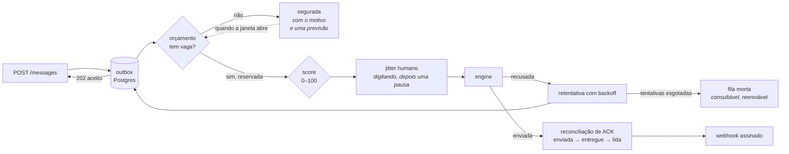
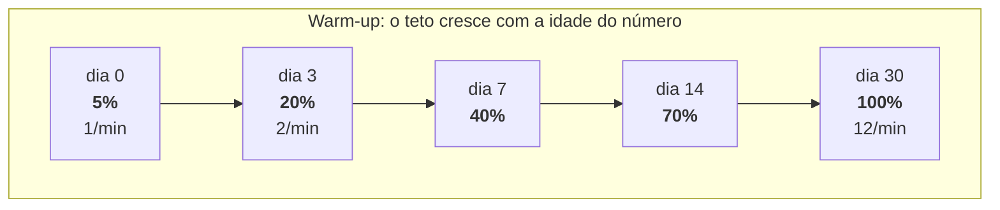
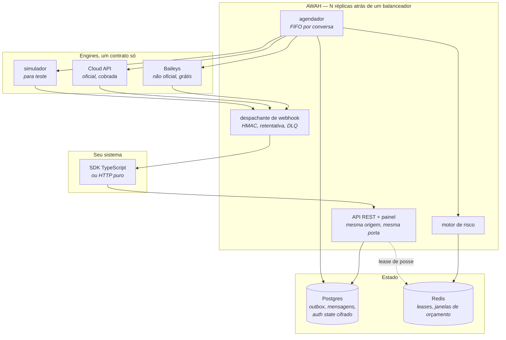

# AWAH

**Gateway de WhatsApp com fila durável, motor de risco e sessões em cluster.**

*[English](README.md)*

[](https://github.com/leoberchielli/awah/actions/workflows/ci.yml)
[](https://github.com/leoberchielli/awah/actions/workflows/image.yml)
[](LICENSE)
[](#medido-n%C3%A3o-afirmado)
[](docs/VERIFICATION.md)

*A mesma coisa em uma página: [awah.99ia.com.br](https://awah.99ia.com.br)*

A maioria dos gateways resolve *"como envio uma mensagem"*. O AWAH existe para a
segunda pergunta: **"como envio dez mil sem perder nenhuma e sem perder o
número"**.

```bash
curl -O https://raw.githubusercontent.com/leoberchielli/awah/main/docker-compose.yml
docker compose up -d
```

Depois abra `http://localhost:2900`. Não há arquivo de configuração para
escrever nem curl para rodar: o painel conduz a primeira organização, o primeiro
número e a primeira integração.


*Gravado contra uma instância viva. Os últimos segundos são o painel mudando de
idioma: são dez, e os motivos de queda de uma sessão também são traduzidos, em
vez de ficarem em inglês dentro de uma tela traduzida.*

---

## O que acontece com uma mensagem

A parte que separa isto de um botão de enviar. Nada é descartado — o que não
passa agora espera, e diz por quê.



A fila é o produto. A API responde `202` no instante em que a linha fica
durável, antes de qualquer I/O de rede — então um processo que morre não perde
nada, o que é [medido matando um](docs/VERIFICATION.md).

## Por que existe um motor de risco

Engine não oficial faz número ser banido. Toda outra garantia daqui não vale
nada se o número deixar de existir numa terça-feira.

O motor dosa o envio como uma pessoa faria, e o ritmo não é constante — ele
abre conforme o número envelhece:



Um número recém-pareado que dispara mil mensagens no primeiro dia é o padrão de
conta descartável mais óbvio que existe. Essas taxas são
[observadas, não afirmadas](docs/BENCHMARK.md#the-warm-up-curve): três sessões
idênticas exceto pela data de pareamento, com a mesma fila.

## Como é montado



Uma sessão pertence a uma réplica por vez, através de um lease no Redis. Quando
essa réplica morre, outra percebe e assume — o que também é
[conferido matando uma](docs/VERIFICATION.md#killing-things).

---

> [!WARNING]
> **Leia antes de usar.** Engines não oficiais (Baileys, whatsapp-web.js,
> whatsmeow) funcionam por engenharia reversa do protocolo e **violam os termos
> de uso do WhatsApp**. Existe risco real e permanente de bloqueio da conta.
>
> - Use um número dedicado. Nunca o seu pessoal nem o número crítico da empresa.
> - O motor de risco reduz a probabilidade de bloqueio. Ele **não garante nada**.
> - Para carga comercial séria, use a engine `cloud_api` — oficial da Meta, sem
>   risco de banimento, cobrada por conversa.
>
> Este projeto não é afiliado, associado nem endossado pelo WhatsApp ou pela Meta.

---

## Estado

**Ondas 0 a 12 concluídas.** A sessão conecta e pareia, o envio passa por uma fila
durável com ordem garantida por conversa, o motor de risco regula o ritmo para
proteger o número, os eventos saem por webhooks assinados, o gateway roda em
várias réplicas com failover automático, a operação é mensurável por um painel
servido pela própria API, e a engine oficial da Meta roda atrás do mesmo
contrato do Baileys. A onda 8 fechou o conjunto com o SDK, a documentação e o
endurecimento da configuração. **O que falta para o v1.0 não é código: é uso
real.**

| Onda | Entrega | Estado |
| --- | --- | --- |
| 0 | Schema, migrations, autenticação, RBAC, CI, Docker | ✅ |
| 1 | Adapter Baileys, ciclo de vida da sessão, auth state no Postgres | ✅ |
| 2 | Outbox, scheduler, webhooks, retry, DLQ | ✅ |
| 3 | Motor de risco: orçamentos, warmup, throttle adaptativo | ✅ |
| 4 | Cluster: leases, roteamento de comando, failover | ✅ |
| 5 | Telemetria, agregados horários, `/metrics`, tracing | ✅ |
| 6 | Dashboard React: operação, negócio e sessões | ✅ |
| 7 | Adapter Cloud API atrás do mesmo contrato | ✅ |
| 8 | Documentação, SDK TypeScript, hardening | ✅ |
| 9 | Conectores nativos de Chatwoot e Typebot | ✅ |
| 10 | Adoção sem curl: setup no painel e assistentes de conexão | ✅ |
| 11 | Conector HTTP: plugar qualquer plataforma sem conector novo | ✅ |
| 12 | Imagem publicada, multi-arquitetura, com proveniência | ✅ |

> Nada além do pareamento foi exercitado contra um número real de ponta a ponta:
> o QR é gerado e o socket conecta, mas o funil de entrega, os limites do motor
> de risco em carga e o failover com sessão conectada ainda não passaram por um
> aparelho de verdade. Os números do painel vêm dos agregados; a mecânica é
> coberta por 366 testes, e ainda assim é teste, não produção.

## Medido, não afirmado

Quatro das afirmações desta página são baratas de escrever e caras de
verificar, então existe um script que verifica e anota o que encontrou:

```bash
node scripts/benchmark.mjs --url http://localhost:2900 --key "$AWAH_KEY"
```

Ele produz **[docs/BENCHMARK.md](docs/BENCHMARK.md)**. Da última execução:

| | |
|---|---|
| Envios fora de ordem dentro de uma conversa, na primeira tentativa | **0** de 192 pares |
| Envios recusados recuperados pela retentativa | **todos**, nenhum chegou à fila morta |
| Ingestão por `POST /v1/sessions/:id/messages` | **~450 envios/s** |
| Warm-up: dia 0 · dia 3 · dia 30 | **1,2 · 2,4 · 14,4** envios/min, contra tetos de 1 · 2 · 12 |

A última linha merece ser lida duas vezes. Três sessões idênticas exceto pela
data de pareamento, com a mesma fila: a curva prende cada uma ao próprio teto.
É essa a diferença entre um motor de risco e um limite de taxa escrito num
README.

Todo número vem do engine `simulator`, que substitui apenas o último salto.
Eles descrevem o gateway; não descrevem o WhatsApp. O relatório diz isso logo no
começo e explica o que segue sem medição.

### E as que não são sobre velocidade

Um segundo script pergunta se as garantias valem, e registra o que viu em vez
de apenas se ficou satisfeito:

```bash
node scripts/verify.mjs --url http://localhost:2900 --key "$AWAH_KEY" \
  --email voce@exemplo.com --password ...
node scripts/verify-cluster.mjs --key "$AWAH_KEY"   # precisa do perfil cluster
```

**[docs/VERIFICATION.md](docs/VERIFICATION.md)** — 45 checks em dez grupos, cada
um com sua evidência: chave de leitura recusada ao criar sessão, chave restrita
respondendo 404 e não 403 para uma sessão fora do escopo, assinatura de webhook
recalculada a partir do corpo e do segredo, uma entrega recusada duas vezes que
chegou na terceira, outra que nunca chegou e terminou na fila morta de onde um
replay a trouxe de volta, sessenta mensagens sobrevivendo a um `docker kill` no
meio da drenagem sem nenhuma presa nem perdida, e uma sessão assumida pela
réplica sobrevivente depois que a dona foi morta.

O segundo script dirige o Docker, porque durabilidade e failover não dão para
conferir sem parar um processo — e parada limpa é o caso fácil, então ele usa
SIGKILL.

## Documentação

| Documento | Sobre |
| --- | --- |
| [docs/comecando.md](docs/getting-started.pt-BR.md) | Do zero a uma conversa no Chatwoot, sem curl nenhum |
| [docs/BENCHMARK.md](docs/BENCHMARK.md) | Ordem, retentativa, vazão e a curva de warm-up, medidos |
| [docs/VERIFICATION.md](docs/VERIFICATION.md) | 45 checks contra instância viva, cada um com sua evidência |
| Este README | O que o projeto faz e como usar cada parte |
| [docs/integracoes.md](docs/integrations.pt-BR.md) | Ligar Chatwoot e Typebot, e o que o gateway acrescenta a eles |
| [docs/qualquer-plataforma.md](docs/any-platform.pt-BR.md) | O conector HTTP: n8n, Make, serverless, sistema próprio |
| [docs/producao.md](docs/production.pt-BR.md) | Subir e não se arrepender: TLS, backup, réplicas, monitoramento |
| [docs/solucao-de-problemas.md](docs/troubleshooting.pt-BR.md) | Os sintomas que aparecem de verdade e o que cada um costuma ser |
| [packages/sdk](packages/sdk/README.pt-BR.md) | Cliente TypeScript, sem dependências |
| [SECURITY.md](SECURITY.pt-BR.md) | Modelo de ameaça e como reportar vulnerabilidade |
| [CONTRIBUTING.md](CONTRIBUTING.pt-BR.md) | Como ajudar, e o que ajuda mais agora |
| [site/](site/README.pt-BR.md) | A página em awah.99ia.com.br, e como publicá-la |

Com a instância no ar, `/docs` traz a referência interativa de todas as rotas.

## Subir

Sem clonar nada:

```bash
curl -O https://raw.githubusercontent.com/leoberchielli/awah/main/docker-compose.yml
```

```bash
docker compose up -d
```

A imagem vem pronta do registro — multi-arquitetura, amd64 e arm64, então roda
igual num VPS barato, num Mac com Apple Silicon ou num Raspberry Pi.

Isso levanta Postgres, Redis, aplica as migrations e sobe a API em
`http://localhost:2900`. Abra no navegador: a primeira vez mostra a tela de
setup, onde você cria a organização e o seu usuário. Ela fecha sozinha depois
disso, e novos usuários passam a entrar por convite.

Daí em diante são três passos, todos no painel: parear o número na aba
**Sessões**, ligar a ferramenta na aba **Integrações**, e acompanhar em
**Operação**. O passo a passo completo está em
[docs/comecando.md](docs/getting-started.pt-BR.md); a documentação interativa da API, em
`/docs`.

## Desenvolvimento

```bash
pnpm install
```

Suba só as dependências e rode a API no host, com recarga automática:

```bash
docker compose up -d postgres redis
```

```bash
cp .env.example .env
```

Gere os dois segredos e coloque no `.env`:

```bash
openssl rand -base64 32
```

```bash
openssl rand -base64 48
```

Aplique as migrations e suba:

```bash
pnpm db:migrate && pnpm dev
```

### Rodar a partir do código

O `docker-compose.yml` puxa a imagem publicada, que é o caminho de quem só quer
experimentar. Para construir a sua, junte o override:

```bash
docker compose -f docker-compose.yml -f docker-compose.dev.yml up -d --build
```

Ou ponha `COMPOSE_FILE=docker-compose.yml:docker-compose.dev.yml` no seu `.env`
e volte a usar `docker compose up -d` normalmente.

### Comandos

| Comando | O que faz |
| --- | --- |
| `pnpm dev` | API com recarga automática |
| `pnpm dev:web` | Dashboard em `:2891`, com proxy para a API |
| `pnpm test` | Testes unitários |
| `pnpm typecheck` | Checagem de tipos |
| `pnpm lint` | Lint e formatação (Biome) |
| `pnpm db:generate` | Gera migration a partir do schema |
| `pnpm db:migrate` | Aplica migrations pendentes |
| `pnpm db:studio` | Abre o Drizzle Studio |
| `pnpm build` | Compila API, painel e SDK |

## Conectar um número

O painel faz isso sem curl: crie a sessão, inicie, e o painel de pareamento
abre com o código e os quatro passos a seguir no telefone.


O código se renova sozinho e o painel se fecha no instante em que o telefone
aceita. O QR acima está morto há muito tempo — aquela sessão foi apagada logo
depois da gravação.

Se preferir pelo terminal, o QR é trocado a cada poucos segundos, então
busque-o depois do START:

```bash
curl -X POST http://localhost:2900/v1/sessions -H "Authorization: Bearer $AWAH_KEY" -H 'content-type: application/json' -d '{"name":"atendimento"}'
```

```bash
curl -X POST http://localhost:2900/v1/sessions/$ID/start -H "Authorization: Bearer $AWAH_KEY"
```

```bash
curl http://localhost:2900/v1/sessions/$ID/qr -H "Authorization: Bearer $AWAH_KEY"
```

A resposta traz o QR em texto cru e como PNG em `data:` URI, pronto para uma tag
``. Quem preferir código a QR usa `POST /v1/sessions/$ID/pairing-code` com
o número em dígitos.

| Rota | O que faz |
| --- | --- |
| `POST /v1/sessions` | Cria o registro da sessão |
| `POST /v1/sessions/:id/start` | Abre a conexão |
| `POST /v1/sessions/:id/stop` | Desconecta preservando credenciais |
| `POST /v1/sessions/:id/logout` | Remove o dispositivo do aparelho e apaga credenciais |
| `GET /v1/sessions/:id/qr` | QR do pareamento em curso |
| `POST /v1/sessions/:id/pairing-code` | Código de 8 dígitos, alternativa ao QR |
| `GET /v1/sessions/:id/events` | Timeline de conexão e queda, com causa traduzida |
| `GET /v1/engines` | Matriz de capacidades por engine |

### Quando uma sessão cai

`GET /v1/sessions/:id/events` devolve o código bruto do protocolo ao lado da
causa em português. A diferença importa: `428` é queda de socket que volta
sozinha, `440` significa que a credencial foi aberta em outro lugar e insistir
piora, e `401` quer dizer que o aparelho desconectou o dispositivo e só um novo
pareamento resolve. O gateway reconecta sozinho apenas nos casos em que
reconectar ajuda — com backoff exponencial e jitter, para que dez sessões que
caem juntas não voltem todas no mesmo milissegundo.

Sessão que não pareia: suba `ENGINE_LOG_LEVEL=debug` e reinicie.

## Enviar mensagem

```bash
curl -X POST http://localhost:2900/v1/sessions/$ID/messages -H "Authorization: Bearer $AWAH_KEY" -H 'content-type: application/json' -d '{"chatId":"5511987654321","text":"olá","clientMessageId":"pedido-4821"}'
```

Responde **202, não 200** — e a diferença é a tese do projeto. A mensagem foi
persistida, não entregue. Prometer entrega numa resposta síncrona seria mentira:
o WhatsApp pode estar fora do ar, a sessão pode ter caído, e a partir da onda 3 o
motor de risco pode segurar o envio de propósito. O estado real vive em
`GET /v1/outbox/:id` e nos webhooks.

**`clientMessageId` é sua chave de idempotência.** Reenviar o mesmo valor
devolve o envio original com `duplicate: true` e não gera segunda mensagem — o
retry do seu lado, depois de um timeout de rede, é seguro por construção. Se
omitir, o AWAH gera um.

O `chatId` aceita o número com código do país ou o JID completo.

### O que a fila garante

- **Ordem por conversa.** Dentro de um chat, sai na ordem em que entrou, e nunca
  há dois envios simultâneos para o mesmo destinatário. Chats diferentes seguem
  em paralelo.
- **Nada se perde.** A linha existe no banco antes de qualquer I/O de rede. Se o
  processo morrer no meio, a mensagem sai depois.
- **Indisponibilidade não é falha.** Sessão caída ou ainda em pareamento devolve
  o envio à fila sem consumir tentativa. Só erro real de entrega conta.
- **Nada é descartado.** Esgotadas as tentativas, a mensagem vai para a DLQ e
  continua consultável em `GET /v1/outbox?status=dead`, com replay por
  `POST /v1/outbox/:id/retry`.

## Motor de risco

É a razão de existir do projeto. Todo envio passa por ele entre a reserva na
fila e a chamada da engine.

**Ele nunca descarta uma mensagem.** Quando o orçamento acabou, o envio volta
para a fila com a hora em que a janela abre — e essa hora é real, calculada a
partir do envio mais antigo ainda dentro da janela. Quando o comportamento se
parece com disparo em massa, o ritmo cai. Recusar não é uma das opções.

### Orçamento

Janelas deslizantes por sessão — minuto, hora, dia — e um teto separado de
**contatos novos por dia**, que é o sinal de spam mais forte que o WhatsApp lê.
Janela deslizante e não balde de hora cheia: um balde deixaria mandar o teto às
13h59 e o teto de novo às 14h00.

### Aquecimento de chip

Um número recém-pareado começa com **5% do teto** e chega a 100% em trinta dias,
por rampa interpolada. Os limites que você configura são o alvo, não o valor de
hoje:

```bash
curl -X PUT http://localhost:2900/v1/sessions/$ID/risk/limits -H "Authorization: Bearer $AWAH_KEY" -H 'content-type: application/json' -d '{"perMinute":30,"perDay":5000}'
```

Configurar 5000 por dia numa sessão pareada hoje resulta em 250 efetivas. É
proposital.

### Score 0–100

Quatro sinais, cada um com peso e explicação própria:

| Sinal | Peso | Por quê |
| --- | --- | --- |
| Conversa unilateral | 35 | Gente conversa nos dois sentidos; robô só fala |
| Contatos novos | 25 | Falar com muitos desconhecidos é o que gera denúncia |
| Falha de entrega | 25 | Indica lista comprada ou desatualizada |
| Velocidade | 15 | Reage antes de o teto ser batido |

Acima de 40 o ritmo começa a cair; acima de 90 vai a 10% da vazão. Nunca chega a
zero — parar sozinho seria indistinguível de um bug.

```bash
curl http://localhost:2900/v1/sessions/$ID/risk -H "Authorization: Bearer $AWAH_KEY"
```

A resposta traz o score com a contribuição de cada fator, o consumo das janelas
e os limites em vigor. `GET /v1/risk/events` guarda cada decisão com o retrato
do orçamento no instante — responde por que um envio específico atrasou, meses
depois.

### Comportamento humano

Intervalo log-normal entre envios (a maioria perto da mediana, com pausas longas
ocasionais) e presença de digitação proporcional ao texto antes de cada mensagem.
Intervalo uniforme produz um padrão regular, que é justamente o que se evita.

### Override

```bash
curl -X POST .../messages -H 'x-awah-bypass-risk: true' ...
```

Fura a fila sob responsabilidade de quem chamou. Fica registrado em
`risk_events` como qualquer outra decisão.

`RISK_ENGINE_ENABLED=false` desliga tudo. Só use com número descartável.

## SDK

```bash
npm install @awah/sdk
```

```ts
import { Awah } from '@awah/sdk'

const awah = new Awah({ baseUrl: 'https://awah.suaempresa.com', apiKey: process.env.AWAH_KEY! })

await awah.messages.sendText(sessionId, {
  chatId: '5511987654321',
  text: 'olá',
  clientMessageId: 'pedido-4821',
})
```

Sem dependências, sobre `fetch` e WebCrypto — roda em Node, Deno, Bun, Cloudflare
Workers e no navegador. Repete sozinho `408`, `429`, `5xx` e falha de rede, e não
repete os demais `4xx`, porque mandar de novo produz a mesma rejeição.

**Ele gera o `clientMessageId` quando você não passa um**, e é isso que torna o
retry automático seguro: sem chave de idempotência, repetir um POST depois de um
timeout de rede mandaria a mesma mensagem duas vezes ao cliente final.

Traz também a verificação de assinatura de webhook, que é o pedaço que mais dá
errado quando se implementa na mão. Detalhes em
[packages/sdk](packages/sdk/README.pt-BR.md).

## Webhooks

```bash
curl -X POST http://localhost:2900/v1/webhooks -H "Authorization: Bearer $AWAH_KEY" -H 'content-type: application/json' -d '{"url":"https://seu-sistema/hook","events":["*"]}'
```

Eventos: `message.received`, `message.sent`, `message.status`, `message.failed`,
`session.status`. O segredo aparece **uma única vez** na resposta de criação.

Cada entrega leva `x-awah-signature` (`sha256=…`) e `x-awah-timestamp`. A
assinatura cobre `timestamp.corpo`, não só o corpo — assim uma entrega capturada
não pode ser reenviada depois: mudar o timestamp para escapar da janela invalida
a assinatura.

```js
const esperado = 'sha256=' + createHmac('sha256', segredo).update(`${timestamp}.${corpo}`).digest('hex')
```

Entregas têm backoff exponencial e fila morta própria, consultável em
`GET /v1/webhooks/deliveries?status=dead` e reprocessável em
`POST /v1/webhooks/deliveries/replay`. Resposta 4xx que não seja 408 ou 429 vai
direto para a fila morta — repetir não conserta payload rejeitado.

## Painel

O dashboard é servido pela própria API, na mesma origem. Não é detalhe de
empacotamento: é o que permite que a credencial do painel seja um cookie
`httpOnly` em vez de um token guardado no `localStorage`. Em origens separadas o
navegador exigiria `SameSite=None`, e o cookie passaria a viajar em requisição de
terceiro — exatamente o que ele deveria impedir.

Entre em `http://localhost:2900` com o usuário criado no `register`. Chave de
API não entra aqui, e é proposital: uma chave colada no navegador fica ao alcance
de qualquer extensão instalada.

| Aba | O que responde |
| --- | --- |
| **Operação** | Está tudo no ar? A mensagem está saindo? O risco está segurando algo? |
| **Negócio** | Quanto se conversa, quanto se responde e em quanto tempo |
| **Sessões** | Parear, iniciar, parar, e ver risco e histórico de queda de cada número |
| **Integrações** | Ligar Chatwoot, Typebot ou qualquer endpoint HTTP, e testar antes de confiar |
| **Chaves** | Emitir chave de API, escopar por sessão, revogar |
| **Usuários** | Adicionar pessoas, mudar papel, remover acesso |

A janela de tempo e o filtro de sessão moram na **URL**. Um operador que vê algo
estranho manda o link para o colega e o colega abre exatamente a mesma tela, em
vez de "clica em 7 dias, depois filtra por...".

O painel destaca uma divergência específica: sessão com `desired_state=running`
que não está rodando. É o estado que custa dinheiro em silêncio — a fila
continua aceitando mensagens e nada sai.

### Sobre a leitura visual

Estado é forma **e** cor: cada pílula tem um ponto além do tom, porque daltonismo
é comum e um painel que só fala por cor exclui parte de quem o opera. Todo número
está em fonte monoespaçada com dígito tabular — coluna que não dança quando o
valor muda. Tema claro, escuro e "o do sistema", que é o padrão.

### Ver o painel com dados

Instância nova mostra painel vazio, o que é correto e pouco informativo. Para
conferir os gráficos antes de ter tráfego real:

```bash
docker compose exec -T postgres psql -U awah -d awah -f /dev/stdin < apps/api/scripts/seed-demo-metrics.sql
```

São **dados sintéticos**, gravados só em `metrics_hourly`. O mesmo arquivo traz o
`DELETE` que os remove.

### Servir de outro lugar

A API procura o build em `public`, `apps/api/public`, `../web/dist` e
`apps/web/dist`, nessa ordem, e sobe sem painel se não achar nenhum — a API é
útil sozinha. `DASHBOARD_DIR` aponta um diretório explícito e ganha de todos.

## Engine oficial da Meta

O ponto do adapter `cloud_api` não é a Cloud API em si — é ela caber no mesmo
`EngineAdapter` do Baileys. Com as duas atrás do mesmo contrato, quem integra
escreve o código uma vez e migra do não oficial para o oficial trocando uma
linha: começa barato e sujeito a bloqueio, termina caro e blindado, sem
reescrever nada.

```bash
curl -X POST http://localhost:2900/v1/sessions -H "Authorization: Bearer $AWAH_KEY" -H 'content-type: application/json' -d '{"name":"oficial","engine":"cloud_api"}'
```

```bash
curl -X PUT http://localhost:2900/v1/sessions/$ID/credentials -H "Authorization: Bearer $AWAH_KEY" -H 'content-type: application/json' -d '{"phoneNumberId":"1098...","accessToken":"EAAG...","verifyToken":"um-segredo-seu","appSecret":"o-app-secret-da-meta"}'
```

A resposta devolve a URL para cadastrar no app da Meta. As credenciais são
cifradas na mesma tabela do auth state do Baileys, e não em `sessions.config`: o
token permite enviar mensagem em nome da empresa e ler as conversas dela — é
credencial, não configuração. Nenhuma leitura da API devolve o token.

**Não há pareamento nem socket.** "Conectar" é confirmar que o token alcança o
número, e falhar aí é o ponto: sem essa verificação, uma credencial errada só
apareceria na primeira mensagem, já dentro da fila e contando como falha de
entrega. As mensagens chegam por webhook, no endpoint `/webhooks/meta/:id`.

### O que muda ao trocar de engine

`GET /v1/engines` publica a matriz. O resumo:

| | `baileys` | `cloud_api` |
| --- | --- | --- |
| Pareamento por QR | sim | não — é token |
| Grupos | sim | não |
| Presença de digitação | sim | não existe na API |
| Conversa livre | sempre | só dentro da janela de 24 h |
| Risco de bloqueio | real | nenhum |
| Custo | zero | por conversa, cobrado pela Meta |

Fora da janela de 24 h a Cloud API só aceita template aprovado. O erro `131047`
da Meta é traduzido para essa frase em vez de vazar o código — sem tradução,
quem integra vê um número e conclui que a credencial quebrou.

### Segurança do webhook

O callback da Meta é o **único endpoint público** do sistema: quem chama é a
infraestrutura deles, sem chave de API. Toda a defesa está na assinatura, e por
isso o `appSecret` é obrigatório — sem ele haveria um caminho anônimo para
injetar mensagens falsas na conta de qualquer cliente. A conferência é HMAC sobre
os **bytes crus** do corpo, não sobre o JSON reserializado: reserializar produz
bytes parecidos, não idênticos, e o HMAC falharia de forma intermitente e
inexplicável.

## Integrações

O AWAH não tem caixa de entrada nem construtor de fluxo, e isso é decisão, não
lacuna. O Chatwoot já resolve atendimento humano; o Typebot já resolve fluxo;
qualquer outra plataforma entra pelo conector HTTP. O que falta a todas elas é
justamente o que o gateway tem:

| | Ligado direto na Meta | Com o AWAH embaixo |
| --- | --- | --- |
| Ordem por conversa | sem garantia | FIFO por chat, chats em paralelo |
| Mensagem perdida | dispara e esquece | fila durável, retry, DLQ com replay |
| Ritmo de envio | o que a ferramenta mandar | orçamento, warmup e freio adaptativo |
| Reentrega duplicada | manda de novo | idempotência por chave |
| Estado de entrega | "enviei" | funil sent → delivered → read |

Ligar leva dois campos: o endereço do Chatwoot e um token de acesso. O gateway
descobre o resto — a conta, as caixas que existem — e **cria a caixa API já com o
webhook apontado para ele**. Descobrir o `accountId` na URL, descobrir o
`inboxId` na URL e voltar lá para colar o webhook eram os três passos que mais
faziam gente desistir; nenhum deles existe mais.

A conexão é testada antes de gravar: credencial errada guardada em silêncio só
apareceria na primeira mensagem de um cliente real.

O Typebot pede só o **link de compartilhamento** do fluxo — endereço e id saem
dele.

```bash
curl -X PUT http://localhost:2900/v1/sessions/$ID/integrations/typebot -H "Authorization: Bearer $AWAH_KEY" -H 'content-type: application/json' -d '{"shareUrl":"https://typebot.io/meu-fluxo"}'
```

### Qualquer outra plataforma

Os dois conectores acima existem porque são os casos mais comuns. Para o resto há
o **conector HTTP**: o gateway posta cada mensagem recebida na sua URL e envia de
volta o que a resposta trouxer.

```bash
curl -X PUT http://localhost:2900/v1/sessions/$ID/integrations/http -H "Authorization: Bearer $AWAH_KEY" -H 'content-type: application/json' -d '{"url":"https://n8n.exemplo.com/webhook/atendimento","secret":"um-segredo-bem-longo"}'
```

Responda `{"reply":"texto"}` e a mensagem sai. Responda vazio e nada sai — válido
para quem só quer registrar. Com isso, n8n, Make, uma função serverless ou o
sistema da casa viram o robô sem ninguém escrever conector novo aqui dentro.

**Isso não é o mesmo que um webhook.** Webhook avisa e esquece: a resposta dele é
ignorada. O conector faz pergunta e resposta, e o que volta entra pela mesma fila
de qualquer envio — com ordem por conversa, motor de risco e reentrega. Um fluxo
do n8n ligado direto na Meta não tem nada disso.

O painel tem um botão **Testar** que manda um evento de exemplo e mostra status,
tempo, o corpo cru e — quando a resposta não vira mensagem — o motivo. Receitas
para cada plataforma em
[docs/qualquer-plataforma.md](docs/any-platform.pt-BR.md).

Os dois convivem na mesma sessão, que é o arranjo mais útil: o Typebot atende
primeiro, e quando o cliente digita **atendente** o fluxo se cala e o agente
assume uma conversa que já tem todo o histórico.

Detalhes, incluindo o que não é reenviado e por quê, em
[docs/integracoes.md](docs/integrations.pt-BR.md).

## Métricas

Quatro famílias, uma rota cada. Todas leem dos agregados horários, nunca das
tabelas cruas — é o que mantém o painel rápido conforme a base cresce.

| Rota | Responde |
| --- | --- |
| `GET /v1/kpi/sessions` | Uptime, quedas com causa traduzida, MTBF por sessão |
| `GET /v1/kpi/delivery` | Funil sent→delivered→read, latência p50/p95/p99, fila, DLQ |
| `GET /v1/kpi/risk` | Decisões do motor, contatos novos, série do score |
| `GET /v1/kpi/business` | Volume por hora, conversas ativas, tempo de 1ª resposta, top contatos |

Aceitam `?hours=` (padrão 24, até 720) e `?sessionId=`.

**Latência por percentil, não por média.** A distribuição tem cauda longa: a
maioria das mensagens chega em segundos e algumas levam minutos porque o
destinatário estava sem rede. A média some com esse comportamento; o p95 o
mostra.

### Prometheus

```bash
curl http://localhost:2900/metrics -H "Authorization: Bearer $METRICS_TOKEN"
```

Séries de negócio (`awah_messages_sent_total`, `awah_outbox_depth`,
`awah_risk_decisions_total`, `awah_send_duration_seconds`) e de processo (heap,
GC, atraso do event loop). Toda série carrega o rótulo `node`, para distinguir
réplicas no mesmo scrape.

Defina `METRICS_TOKEN`: sem ele, a URL entrega volume de mensagens, número de
sessões e saúde da operação a quem alcançar a porta.

### Tracing

O código é instrumentado com **apenas a API** do OpenTelemetry — poucos
quilobytes, e sem SDK registrado todas as chamadas viram no-op. Embutir o SDK
completo cobraria dezenas de megabytes de todo mundo, inclusive de quem nunca
vai olhar um trace. Quem quiser, pluga no boot:

```bash
node --require ./otel.js apps/api/dist/index.js
```

## A imagem

`ghcr.io/leoberchielli/awah` — multi-arquitetura (amd64 e arm64), publicada
pelo CI a cada push.

| Tag | O que é |
| --- | --- |
| `latest` | Última versão marcada com tag. É a que você quer. |
| `edge` | Ponta da branch principal. Pode quebrar. |
| `1.2.3`, `1.2`, `1` | Versão exata e as faixas dela |
| `sha-abc1234` | Commit específico, para fixar sem ambiguidade |

Cada publicação carrega uma **attestation de proveniência** assinada, verificável
com o `gh`:

```bash
gh attestation verify oci://ghcr.io/leoberchielli/awah:latest --owner leoberchielli
```

Não é cerimônia: quem roda um gateway de WhatsApp tem as credenciais dos próprios
clientes dentro dele, e conferir de onde veio o binário antes de subir é o mínimo.

`GET /health` devolve a versão e o commit da imagem — a primeira pergunta de
qualquer suporte, respondida sem abrir o contêiner.

## Cluster

Suba quantas réplicas quiser apontando para o mesmo Postgres e Redis. Não há nó
primário, coordenador nem eleição — todos rodam o mesmo código.

```bash
docker compose --profile cluster up -d
```

**Posse por lease.** Cada sessão pertence a um nó de cada vez, por uma chave no
Redis com TTL de 15 s renovada a cada 5 s. Isso não é otimização: duas réplicas
com o mesmo auth state abrem dois sockets para o mesmo número, e o WhatsApp
derruba os dois alternadamente com 440 — o sintoma mais confuso do protocolo.

**Failover automático.** Se o nó dono morre, ninguém renova, o lease expira e
outra réplica assume. Medido em teste com `SIGKILL`: **~20 segundos** até a
sessão voltar ao ar, sem intervenção.

O que torna isso possível é a decisão da onda 1 — o auth state do Baileys vive
no Postgres, cifrado. Enquanto as credenciais estão no disco de um nó, nenhuma
outra réplica consegue assumir coisa alguma.

**Intenção separada do estado.** `desired_state` guarda onde o operador quer a
sessão; `status` guarda onde ela está. O failover só ressuscita o que está
`running` — uma sessão que você parou fica parada.

**Comandos roteados.** Parar, deslogar e pedir código de pareamento exigem o
socket vivo. Chegando na réplica errada, o comando viaja até o dono por pub/sub
e volta com o resultado. Sem isso, essas operações funcionariam ou não conforme
o balanceador escolhesse o nó.

**QR compartilhado.** Publicado no Redis pelo dono, lido por qualquer réplica.

| Variável | Padrão | O que faz |
| --- | --- | --- |
| `NODE_ID` | hostname | Identidade da réplica no cluster |
| `LEASE_TTL_MS` | 15000 | Vida da posse sem renovação |
| `LEASE_RENEW_MS` | 5000 | Intervalo de renovação |
| `FAILOVER_SCAN_MS` | 10000 | Varredura de sessões órfãs |
| `COMMAND_TIMEOUT_MS` | 10000 | Espera por resposta de outro nó |

## Arquitetura

```
apps/api
  auth/           credenciais, RBAC, guarda de permissão
  cluster/        lease, roteamento de comando, failover
  dashboard/      estáticos do painel e fallback de rota de cliente
  engines/        contrato EngineAdapter + Baileys e Cloud API
  integrations/   conectores de Chatwoot, Typebot e HTTP genérico
  sessions/       ciclo de vida, reconexão, posse por nó
  messaging/      outbox, scheduler, persistência, retenção
  risk/           orçamento, warmup, score, jitter
  telemetry/      agregados horários, Prometheus, tracing
  webhooks/       assinatura, entrega, fila morta
  workers/        processos de fundo
  repos/          acesso a dados com escopo de tenant
  modules/        rotas HTTP
apps/web          dashboard React, buildado para dentro da imagem da API
packages/db       Drizzle: schema, migrations, cliente
packages/sdk      cliente TypeScript publicado, sem dependências
```

### Credenciais de sessão

O auth state do Baileys vive no Postgres, cifrado em AES-256-GCM, e não em
arquivo. É o que torna o failover possível: enquanto as credenciais estão no
disco de um nó, nenhuma outra réplica consegue assumir a sessão. As signal keys
ficam numa tabela própria, uma linha por chave — guardá-las num blob único faria
cada mensagem recebida reescrever megabytes.

Postgres e Redis são obrigatórios — não há modo SQLite. É uma decisão
deliberada: um caminho só, sem paridade entre modos para manter, e cluster
funcionando desde o primeiro dia.

### Autenticação

Duas credenciais, com poderes diferentes de propósito:

- **Sessão de usuário** — cookie httpOnly assinado, para o dashboard. Senha em
  argon2id, sessão revogável no banco.
- **Chave de API** — `Authorization: Bearer awah_<prefixo>_<segredo>`, para
  integração. O segredo é guardado só como hash.

Chaves de API **nunca** administram identidade: não criam outras chaves, não
promovem membros, não alteram a organização. Uma chave vaza para logs, para o
histórico de shell e para sistemas de terceiros — quando isso acontecer, o
estrago deve ser "mandaram mensagem no meu nome", não tomada de conta.

### Papéis

| Papel | Alcance |
| --- | --- |
| `viewer` | Leitura de sessões, mensagens e métricas |
| `operator` | O que o viewer faz, mais enviar mensagens e operar sessões |
| `admin` | O que o operator faz, mais gerenciar sessões, chaves, webhooks e membros |
| `owner` | Tudo, incluindo promover outro owner e excluir a organização |

A organização sempre mantém pelo menos um owner — a API recusa rebaixar ou
remover o último.

### Retenção

`retentionDays` na organização controla por quanto tempo o corpo das mensagens é
preservado. Padrão 30 dias; `0` nunca persiste conteúdo, `-1` retém para sempre.
Expirado o prazo, a linha degrada para metadados e os KPIs de volume e latência
continuam funcionando.

## Contribuindo

O projeto está em construção ativa rumo ao v1.0 e ainda não tem release. Issues
com relato de caso de uso real são especialmente bem-vindas nesta fase — as
decisões de arquitetura ainda estão maleáveis. Veja
[CONTRIBUTING.md](CONTRIBUTING.pt-BR.md) para o que ajuda mais agora, e
[SECURITY.md](SECURITY.pt-BR.md) antes de expor uma instância.

## Licença

MIT. Veja [LICENSE](LICENSE).
